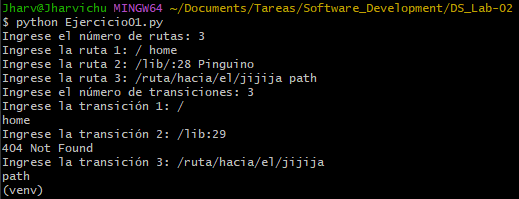
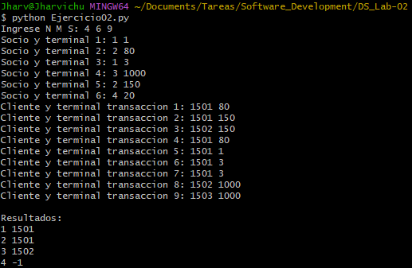

# DS Lab-02

## Ejercicio 01: Sistema de Rutas

Este script simula un sistema de enrutamiento simple, similar a los utilizados en frameworks web. Permite definir rutas con parámetros dinámicos (usando `:` al inicio de un segmento) y luego procesar una serie de transiciones para encontrar coincidencias exactas.

### Funcionalidad:
- **Entrada de rutas**: Primero, se ingresa el número de rutas. Luego, por cada ruta, se proporciona una cadena en formato "ruta contenido", donde la ruta puede incluir segmentos estáticos y parámetros dinámicos (ej. "/users/:id mostrar usuario").
- **Entrada de transiciones**: Se ingresa el número de transiciones. Cada transición es una URL solicitada (ej. "/users/123").
- **Lógica de matching**: Para cada transición, el script compara con cada ruta definida:
  - Divide ambas en segmentos separados por '/'.
  - Si el número de segmentos coincide, verifica cada par:
    - Si el segmento de la ruta comienza con ':', se considera un parámetro y captura el valor de la transición.
    - Si no, debe coincidir exactamente.
  - Si hay coincidencia completa, imprime el contenido de la ruta, reemplazando el parámetro si existe (ej. "mostrar usuario 123").
  - Si no hay coincidencia con ninguna ruta, imprime "404 Not Found".
- **Ejemplo**:
  - Rutas: 2
    - "/users/:id show user"
    - "/posts list posts"
  - Transiciones: 2
    - "/users/456" → Output: "show user 456"
    - "/home" → Output: "404 Not Found"

## Ejercicio 02: Análisis de Compras por Socio

Este script analiza transacciones de compras en un sistema con socios comerciales, terminales y clientes. Cada terminal pertenece a un socio, y las transacciones registran compras de clientes en terminales específicas. El objetivo es determinar, para cada socio, el cliente más fiel (con más compras en sus terminales), resolviendo empates por el ID de cliente más pequeño.

### Funcionalidad Detallada:
- **Entrada inicial**: Una línea con tres números: N (número de socios), M (número de terminales), S (número de transacciones).
- **Asociación de terminales**: M líneas, cada una con "id_socio id_terminal", mapeando cada terminal a un socio.
- **Registro de transacciones**: S líneas, cada una con "id_cliente id_terminal", representando una compra.
- **Procesamiento**:
  - Solo se consideran transacciones en terminales válidas (existentes en el mapa).
  - Se cuenta el número de compras por cliente para cada socio (basado en las terminales del socio).
- **Salida**: Para cada socio (del 1 a N), imprime "id_socio id_cliente_fiel" donde id_cliente_fiel es el cliente con más compras en sus terminales. Si un socio no tiene transacciones, imprime "id_socio -1". En caso de empate en compras, elige el cliente con ID más pequeño.
- **Ejemplo**:
  - Entrada: 2 2 3
  - Terminales: "1 10", "2 20"
  - Transacciones: "100 10", "101 10", "100 20"
  - Salida:
    - 1 100 (cliente 100 tiene 2 compras en terminal 10 del socio 1)
    - 2 100 (cliente 100 tiene 1 compra en terminal 20 del socio 2; socio 1 no tiene más)

## Imágenes de Ejecución

- Imagen de Ejercicio01.py:
  

- Imagen de Ejercicio02.py:
  